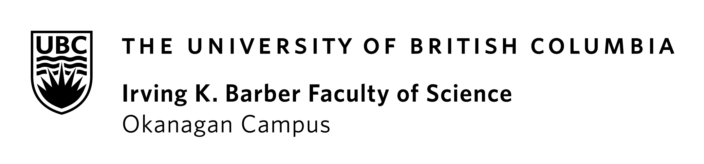
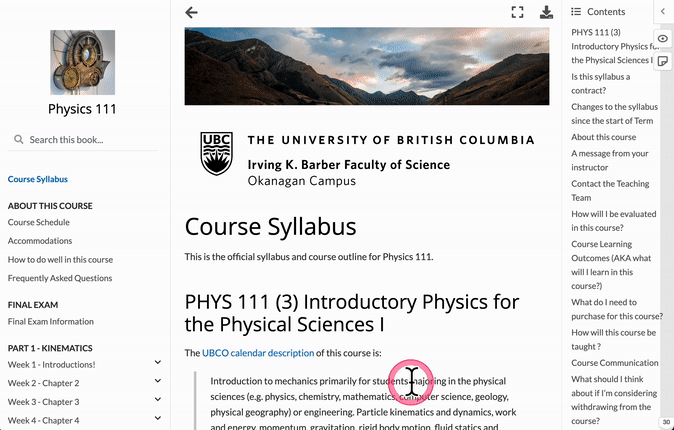

(page_pre_term)=
# Before term starts

Welcome to {{ COURSE_CODE }}, {{ TITLE }} !
I am very excited that you've decided to enrol in my class.
Whether it's your choice to take this course, or if your were forced into it by your program/degree is not really that important - you're here now, and you're welcomed!
Many of you are entering your first year of university in a new city, and maybe even a new country!
To the students local to the area, you have a big responsibility to help your fellow students feel welcome and at home, in their new home.
Everyone should try and make the effort to make some new friends, study partners, and acquaintances.
We're emerging from a lockdowns and online learning, so don't think you're the only one whose social skills have severely deteriorated over the past few years!
Take the time to introduce yourselves, share your favourite places to go, hangout, eat, socialize etc.
Have fun with it, this is your new community!


Image by [Maike und Björn Bröskamp](https://pixabay.com/users/broesis-5213623/?utm_source=link-attribution&amp;utm_medium=referral&amp;utm_campaign=image&amp;utm_content=2366955) from [Pixabay](https://pixabay.com//?utm_source=link-attribution&amp;utm_medium=referral&amp;utm_campaign=image&amp;utm_content=2366955)

I know that for some of you, the days before the term starts is filled with a nervous and anxious excitement, usually the good kind, but often the bad kind too.
I remember when I was a student, I would frantically check to see if course information was updated and whether there was a course website, what the class was going to be like, and if there was anything I could do to get ready for the start of class.
So when I became an instructor, I tried to reach out to my students a week or two before the term started to introduce myself and give them a few tasks to do to prepare for my class and the new school term.

```{note}
Having some stuff to do before the term starts works for some students, but for others it really feels like I'm interrupting the last days of your summer vacations. Feel free to ignore this and come back to it whenever you're ready after the term has started! You won't be missing much and it really won't take that long to do.
```

Here is a list of things you can do (but don't have to) before the term starts:

```{dropdown} 📧 1. Sign up for a UBC Student Email address!
    :class-container: sd-shadow-lg
    :color: success

As a student of UBC you are entitled to a free, secure, institutional email address: **<your_cwl>@student.ubc.ca**.
But, to claim it, you must first activate it.

Here are the steps to sign up for a Student Email Address:

- Sign in to the [CWL myAccount page](https://www.myaccount.ubc.ca/myAccount/login.xhtml) and click on **Activate Student Email**
    - You must be registered in a course and in good standing to be eligible for this service
- Check your [UBC Student Email online](https://webmail.student.ubc.ca/)
- Set up your UBC email on your mobile device
    - [iOS](https://ubc.service-now.com/kb_view.do?sysparm_article=KB0016885)
    - [Android](https://ubc.service-now.com/kb_view.do?sysparm_article=KB0016889)
- Set up your UBC email on your laptop or desktop to send/receive email
    - macOS
        - Open the "Mail" app on your macOS
            - If you've never linked an email account before, it will ask you to add an Account
            - If you already have a different account added to your Mail app (for e.g., your gmail account), click on Mail on the top menubar and click "Add Account"
        - Choose "Microsoft Exchange" as the account option
        - Enter in your email address: <your_cwl>@student.ubc.ca
        - Enter in your password at the prompt, and it should authenticate
    - [Windows](https://ubc.service-now.com/kb_view.do?sysparm_article=KB0016884)

You should get into the habit of using this email address as much as possible during your career at UBC.
This account will also grant you access to a range of other UBC services including a free license to Microsoft Office and OneDrive.
```

```{dropdown} 🖨 2. Set yourself up to Print on Campus
    :class-container: sd-shadow-lg
    :color: success

UBCO has a super sweet printing process that is fast and convenient!
You can print from anywhere on campus and then go to your closest printer to pick up your documents.
I encourage you to set it up and try it once before things get crazy and you need to print things in a panic.
You'll never know when you need it!

[Set up your computer to print here.](https://it.ok.ubc.ca/services/computers-printers/printing-at-ubco/pay-for-print-students/)
```

```{dropdown} 🖊 3. Create a Hypothesis account (Optional)
    :class-container: sd-shadow-lg
    :color: success

There's a really awesome tool called [hypothes.is](https://hypothes.is) - when enabled, it allows anyone to highlight and comment on any website.
I have turned this feature on for our unsyllabus because I want to know what you think of the unsyllabus in our course!
Yes, it's *our* course, we're in this together and there are some opportunities for you to determine how we do things in this course.
I want your thoughts, feedback, and opinions on how you want the course to go this term.
Similarly, if you have any questions about any part of the unsyllabus, the best place to ask it is right in the document itself.
If you have a good idea for a change to the unsyllabus - I'd love to hear them, and even adopt them if they fit within the goals of the course.
I strongly believe that you are now in charge of your own education, and I am just a guide to help point you in the right direction!

Here's an animated gif of how to annotate (you'll need to sign up for a free account):



This is an experiment, and I encourage you to make comments and highlights on our unsyllabus.
Let's see how it goes!
Remember that your classmates will be able to see your comments too, so feel free to interact with them on here as well - we're in this together.
Don't be shy, but please also be respectful and courteous.
```

## Say Hello!

If you created a Hypothes.is account, **select this bolded text** and make a comment about your favourite activity.

## Frequently asked questions (before the term starts)

````{dropdown} How do I address my professors at UBCO?
    :class-container: sd-shadow-lg
    :color: primary
    :open:

```{tip}
The short answer is: always use `Dr.` + `<last name>` or `Professor` + `<last name>`.
So you would call me `Dr. Moosvi` in emails and in-person.
```

The long answer is a bit of a rant, so bear with me here!

```{dropdown} Read the long version here!
    :class-container: sd-shadow-lg
    :color: warning

There is somewhat of a tension in the Ivory Tower as it has long been accepted and assumed that students at university are considered adults and thus, should be on a first-name basis with their professors.
After all, if we want students to be comfortable in their environment, and in the name of community-building then students should drop the formalities of titles and just refer to their professors using just their first name.
Well, it's a bit more complicated than that.
It turns out that in our society, job titles have a lot of meaning and authority - particularly for minoritized individuals such as women and people of colour, who are already less likely to be perceived as experts (see [this article](https://www.bbc.com/worklife/article/20210216-why-do-professional-titles-actually-matter) for more about this).
Of course it is very uncomfortable and socially inappropriate to "correct" people about your title, it seems like "bragging" or, being "uptight" and "hierarchical", as well as a host of other adjectives I'd rather not point out.
On the other hand, we also know that students come from a variety of different cultures and backgrounds and it may be completely inappropriate and foreign for them to refer to individuals of authority by their first names.
For these students, it can result in crippling anxiety and fear to refer to their instructors by their first names when they insist, so rather than deal with the turmoil of these interactions, they choose to not to interact with their instructors at all.
This is very unfortunate, and a reminder to us all that there are always consequences to our decisions and we need to think through our established conventions through the lens of "who is this harming?".

Finally, I recognize that a lot of this may be "[hidden curriculum](https://www.edglossary.org/hidden-curriculum/)" and students may not be aware of these conventions.
I do not believe that students are intentionally referring to their instructors using incorrect honorifics (Mr., Ms., and the worst: Miss or Mrs).
However, it is an unfortunate and dark part of our society that it tends to happen way more to my female colleagues.
Practically speaking, in almost all cases^, and instructors here need a PhD to teach, so even if unintentional or accidental, you are devaluing their accomplishments and titles by referring to them as anything other than `Dr.` or `Professor`.
These titles that have been incredibly hard-earned (PhDs tend to have 5-7 years of additional education and training after a bachelor's degree), often in extremely traumatic circumstances (particularly for minoritized folks). 
In general, I encourage you all to look within yourself and fight against your inner biases when it comes to equity and inclusion.
Specifically in this case, I suggest you **always** refer to your instructors at UBCO with `Dr.` + `<last name>` or `Professor` + `<last name>`.

^ *Note: In some rare cases, there may be exceptional senior grad students or exceptional teachers with Masters degrees teaching your courses. 
Even in those cases, unless they tell you otherwise and insist, it's usually wisest (and politest) to refer to them as `Dr.` or `Professor` as well.*
```

```{tip}
👋🏽 If you have been referred to this page by me after an email exchange with me, please do not despair or feel bad! I do not think any less of you, I am just using this opportunity to educate you about appropriately addressing your instructors. There is absolutely no need to apologize, all is forgiven! Use this opportunity to learn more about this, and you'll do the right thing next time, I'm sure 😊! 
```
````

```{dropdown} What if I cannot be in Kelowna by the start of the term?
    :class-container: sd-shadow-lg
    :color: primary

Unfortunately I do not have an answer for you yet - I understand this is probably a really stressful experience and it's definitely not your fault but we're working on it.
I will let you know as soon as we can once we have official word on the process for this.
```

```{dropdown} Do I need to buy anything for this course?
    :class-container: sd-shadow-lg
    :color: primary

No, you do not need to purchase anything for this course.

It would be helpful if you had access to a computing device as we'll be conducting all of our homework and tests online. If this is going to be a problem, please contact me through a private message on {{ FORUM_LINK }} and we can work out an accommodation.
```

```{dropdown} Which textbook are we using for this course?
    :class-container: sd-shadow-lg
    :color: primary

{{ TEXTBOOK }}
```

```{dropdown} Will lectures be recorded so I can re-watch them to study?
    :class-container: sd-shadow-lg
    :color: primary

Yes, lectures will be recorded and posted - mostly for students that miss the class and want to catch up on missed announcements.

In general, I do not think re-watching lectures is a good way to study (even at 1.5x speed).
It will be far more beneficial for you to try doing more problems and come to student hours or go to tutorial for extra help!
```

````{dropdown} What should I do if the course is full and I'm on the waitlist for the class?
    :class-container: sd-shadow-lg
    :color: primary

If the course is full, please register to the waitlist and monitor the SSC for an open seat.
Should a mass seat release be approved by the Department Head, all waitlisted students will be notified by email to register on a first-come, first-served basis.

Check the SSC website frequently to see if any spots open up in the class, and self-register if you can.
Closer to the start of term students are always switching classes and sections so this is probably your best to get registered into the course.
If you are set on joining the class, I suggest attending class physically in-person for as long as possible so you are not behind if/when you do get into the course.
Most of the content I use is open source so you can {{ '[access the course website]({link})'.format(link=COURSE_LINK)}}.

```{tip}
Unfortunately the **course instructor has no control over student registration** and you will not be able to join the Canvas course until you are officially registered in the class.
If you have specific questions, I suggest contacting the department cmps.okanagan@ubc.ca. Note: the operating hours for the CMPS office are Monday - Friday, 9 a.m. - 4 p.m. (PDT).
```
````

````{dropdown} What if I can't register in the lab/tutorial I want?
    :class-container: sd-shadow-lg
    :color: primary

Unfortunately, there are no waitlists for labs or tutorial sections.
I suggest you definitely register for the course and keep monitoring the space in the section you want (maybe once or twice a week?).
Please continue to monitor the schedule over the summer for an open seat.
The department often adds additional seats, or opens more labs depending on enrolment.
I expect that after things stabilize and students choose their final list of courses, the lab spots will be readily available.
Some lab sections are often blocked to help minimize cases where there are only 3-4 students in a lab section, and depending on enrolment, may open up in the future.

```{tip}
This is usually not an issue, and I don't expect this to be an issue in the future.
I know it's a bit frustrating, but students *always* over-register into more courses than they can realistically take while they consider their options.
If by the start of term, you're still not in a lab/tutorial, then I suggest contacting cmps.okanagan@ubc.ca to let the department know that you're not able to get into a lab/tutorial along with your constraints, and they will likely provide you with some advice.
```
````

```{dropdown} Is this course hard? Will I fail?
    :class-container: sd-shadow-lg
    :color: primary

I have done my best to setup this course so that if you are willing (and able) to put the work in, you will leave this course with a good grades!
I can pretty much guarantee that - there are lots of opportunities for you to work collaboratively with your peers during the lectures and on homework assignments.
There will be frequent tests (roughly every two weeks) in this course and you will always have an opportunity to redo your test for a higher grade.

If you come in with good work ethic, the right attitude, and sufficient motivation, you will do really well - I promise!
```

```{dropdown} Is attendance in lectures, labs, and tutorials mandatory?
    :class-container: sd-shadow-lg
    :color: primary

- Attendance is **highly recommended** in lectures and tutorials, but not required. 
- Tutorials and labs will not be recorded, Lectures will be recorded and made available via Canvas.
- Attendance **is required** in labs.
```