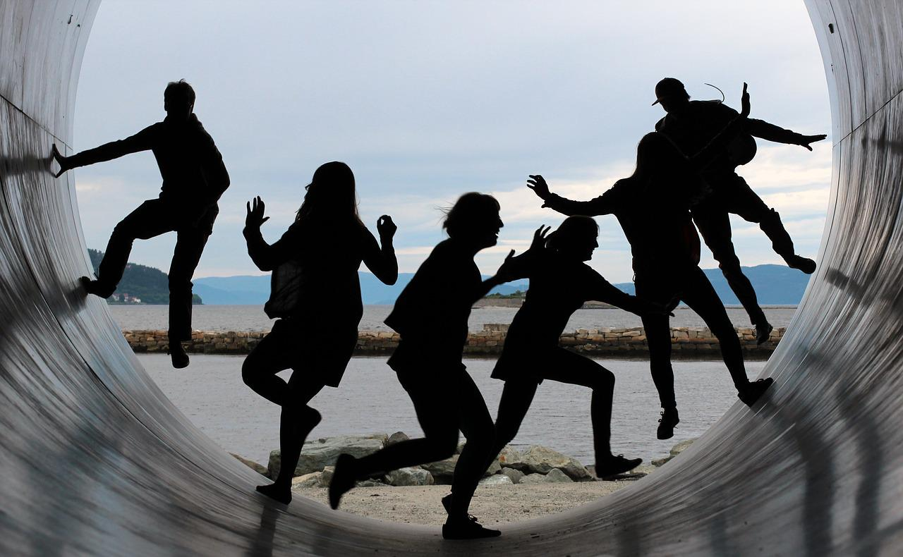

(page_pre_term)=
# Before term starts

Welcome to {{ COURSE_CODE }}, {{ TITLE }} !
I am very excited that you've decided to enrol in my class.
Whether it's your choice to take this course, or if your were forced into it by your program/degree is not really that important - you're here now, and you're welcomed!
Many of you are entering your first year of university in a new city, and maybe even a new country!
To the students local to the area, you have a big responsibility to help your fellow students feel welcome and at home, in their new home.
Everyone should try and make the effort to make some new friends, study partners, and acquaintances.
We're emerging from a lockdowns and online learning, so don't think you're the only one whose social skills have severely deteriorated over the past few years!
Take the time to introduce yourselves, share your favourite places to go, hangout, eat, socialize etc.
Have fun with it, this is your new community!



Image by [Maike und Björn Bröskamp](https://pixabay.com/users/broesis-5213623/?utm_source=link-attribution&amp;utm_medium=referral&amp;utm_campaign=image&amp;utm_content=2366955) from [Pixabay](https://pixabay.com//?utm_source=link-attribution&amp;utm_medium=referral&amp;utm_campaign=image&amp;utm_content=2366955)

I know that for some of you, the days before the term starts is filled with a nervous and anxious excitement, usually the good kind, but often the bad kind too.
I remember when I was a student, I would frantically check to see if course information was updated and whether there was a course website, what the class was going to be like, and if there was anything I could do to get ready for the start of class.
So when I became an instructor, I tried to reach out to my students a week or two before the term started to introduce myself and give them a few tasks to do to prepare for my class and the new school term.

```{note}
Having some stuff to do before the term starts works for some students, but for others it really feels like I'm interrupting the last days of your summer vacations. Feel free to ignore this and come back to it whenever you're ready after the term has started! You won't be missing much and it really won't take that long to do.
```

Here is a list of things you can do (but don't have to) before the term starts:

```{include} bits/01_student_email.md
```

```{include} bits/02_print.md
```

```{include} bits/0X_hypothesis.md
```

```{include} bits/pre_term_faq.md
```