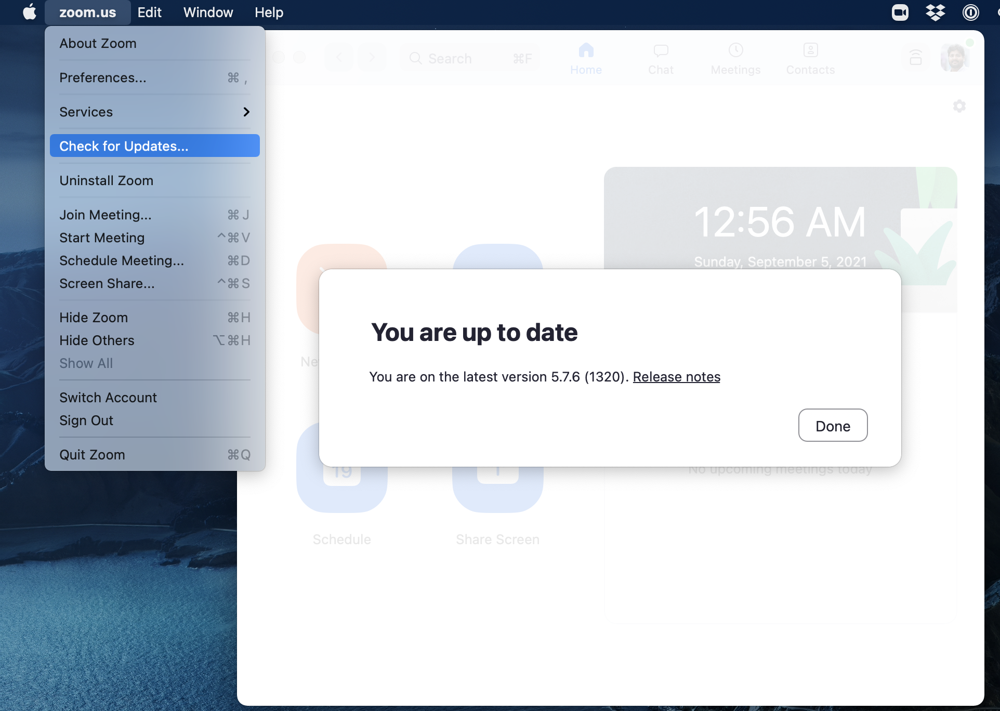
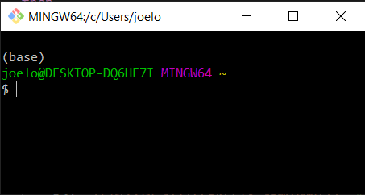
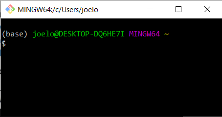

(page_install_ds_stack_windows)=
Windows Software Stack
=======================

<head>
	<base target="_blank">
</head>

These instructions will walk you through installing the required Data Science software stack for {{ COURSE_CODE }}. 
Before starting, ensure that your laptop meets the minimum requirements:

- Runs the latest version of Windows 10 or 11 available for your system.
    - Currently enrolled UBC students with a valid CWL account [qualify for one license of Windows 11 Education](https://it.ubc.ca/services/desktop-print-services/software-licensing/windows-education).
- Can connect to networks via a wireless connection.
- Has at least 25 GB disk space available.
- Has at least 4 GB of RAM (more is recommended).
- Uses a 64-bit CPU.
- Is at most 6 years old at the start of the program (4 years old or newer is recommended).
- Student user has full administrative access to the computer.

If your computer does not meet any of the requirements above, please don't just drop the course!!
Let me know first and we can discuss alternate possibilities so you can still take the course.


```{tip}
Before starting, I suggest updating your Windows operating system to the latest version your laptop can run:

[See here](https://support.microsoft.com/en-us/windows/update-windows-3c5ae7fc-9fb6-9af1-1984-b5e0412c556a) on how to update your Windows 11 machine to the latest version.
```

## Installation notes

Unless you really know what you are doing, if you have already installed Git, Conda, or any of the Python related packages below, I **strongly** advise you to please uninstall these and follow the instructions below to re-install and configure them correctly (make sure to also remove any user configuration files and backup them if desired).
In order to be able to support you effectively and minimize setup issues and software conflicts, we suggest students to install the software stack the same way (even though there are better ways).

In all the sections below, if you are presented with the choice to download either a 64-bit (also called x64) or a 32-bit (also called x86) version of the application **always** choose the 64-bit version.

Once you have completed these installation instructions, make sure to follow the post-installation notes at the end to check that all software is setup correctly.

## Table of Contents

- [UBC Student Email](#ubc-student-email)
- [Zoom](#zoom)
- [Web browser](#web-browser)
- [Microsoft Office](#microsoft-office)
- [Visual Studio Code](#visual-studio-code)
- [Terminal](#terminal-gitbash)
- [Python, Conda, and JupyterLab](#python)
- [Configuring VS Code extensions](#vscode-extensions)
- [Git and GitHub](#git-and-github)
- [Tree](#tree)
- [Test JupyterLab](#test-jupyterlab)

## UBC Student Email

Please sign up for a UBC Student Email. 
This account will also grant you access to a range of other UBC services (not used in this course), including Microsoft Teams and OneDrive. 
To do so navigate to [https://it.ubc.ca/services/email-voice-internet/ubc-student-email-service](https://it.ubc.ca/services/email-voice-internet/ubc-student-email-service) and follow the instructions under "Get Started". 

## Web browser

You are welcome to use most modern browsers that have a WebKit or Gecko backend.
[Safari](https://www.apple.com/ca/safari/), [Firefox](https://www.mozilla.org/en-CA/firefox/new/?redirect_source=firefox-com), [Vivaldi](https://vivaldi.com), [Brave](https://brave.com), [Edge](https://www.microsoft.com/en-us/edge) are all recommended.
Google Chrome is not recommended because of the [well-documented privacy and tracking issues with Google](https://www.forbes.com/sites/zakdoffman/2021/03/20/stop-using-google-chrome-on-apple-iphone-12-pro-max-ipad-and-macbook-pro/).

## Zoom

We will be using Zoom in this course for the classes, as well as the labs, and student hours.
It is *very* important that you have the most recent version of Zoom installed, as we will be using many of the features that are only available in more recent versions.

The latest version of Zoom as of Sept 2022 is: `5.11.10 (102279)`. 
You can ensure you have the latest version of Zoom by clicking "Check for Updates" as shown in the screenshot below (on a Windows machine, your screenshot will look slightly different).



```{important}
Please note that if you have been relying on the "web version" of Zoom that works only in a browser, this will not work for this course!
Please make sure to download the Zoom desktop client for your operating system to fully participate in the course.
```

## GitHub.com account

Sign up for a free account at [GitHub.com](https://github.com/) if you don't have one already.
Your GitHub username is important, here's how to find your username:


## Microsoft Office

UBC students have free access to a Microsoft Office 365 annual subscription, which is renewed for students enrolled in at least one course.
Office 365 includes Word, Excel, PowerPoint, Outlook, and OneNote, and is available on a variety of platforms.

To get your free Office 365 license and download the installer files, visit [UBC IT](https://it.ubc.ca/services/desktop-print-services/software-licensing/office-365-students) for the installation instructions.
Note that you will need your CWL login credentials in order to download the software and activate your license from [portal.office.com](https://portal.office.com).

In this course, you will only need Microsoft Excel, but you're welcome to install other apps as well.

```{important}
You will not be able to use Google Sheets, Apple Numbers, or LibreOffice Calc to do the Excel portion of this course.
If you have trouble installing it, please let the instructor know.
```

## Terminal (GitBash)

Unfortunately, one of the major problems with using the Windows operating system is that the "Command Prompt" that comes with the operating system is severely deficient. 
No worries though, luckily most of the tools we use in this course are open source, so the community has worked hard to shore up deficiencies in the Microsoft ecosystem (until Windows subsystem for Linux is a more mature product).

The replacement for the Command Prompt we will use in this course is called "GitBash".
The latest version of GitBash for Windows is: `2.37.3`.

```{attention}
"GitBash" is relatively old software, but it is very reliable and works very well. 
If you are feeling brave and want to setup `zsh` (the next generation Terminal, with many improvements) on Windows, you can [try these instructions here](https://dev.to/zinox9/installing-zsh-on-windows-37em).
Note that these instructions are experimental and support from the teaching team is limited. But if you can get it to work or run into any issues, let me know.
I hope to adopt zsh on windows fully next time I teach this course.
```

Briefly, we will be using the Bash shell to interact with our computers via a command line interface, and Git to keep a version history of our files and upload to/download from to GitHub.

Go to <https://git-scm.com/download/win> and download the windows version of GitBash.
After the download has finished, run the installer and **accept the default configuration for all pages except for the following**:

- On the **Choosing the default editor used by Git** page, select "Use Visual Studio Code as Git's default editor" from the drop-down menu'
- *Optional* On the **Select Components** page, check "On the Desktop" under "Additional icons".


```{note}
If you wish to pin Git Bash to the taskbar, you need to search for the program in the start menu, right click the entry and select "Pin to taskbar". If you instead first launch the program and pin it by right clicking on the taskbar icon, Git Bash will open with the wrong home directory (`/` instead of `/c/users/$USERNAME`.
```

```{note}
After installation, test if you were successful by opening the GitBash program.
Below is a picture of the Git Bash icon on the Desktop and an opened instance of the Git Bash terminal (we will often refer to this as just the "Terminal").
From now on, all commands should be entered into the GitBash program (not Anaconda Command Prompt, or Command Prompt, or PowerShell etc...).
```


In the terminal, type the following to check which version of Bash you just installed:

```
bash --version
```

The output should look similar to this:

```
GNU bash, version 4.4.23(1)-release (x86_64-pc-sys)
Copyright (C) 2019 Free Software Foundation, Inc.
License GPLv3+: GNU GPL version 3 or later <http://gnu.org/licenses/gpl.html>

This is free software; you are free to change and redistribute it.
There is NO WARRANTY, to the extent permitted by law.
```

> If you tried to paste the above into the Git Bash terminal, you will have noticed that `Ctrl+V` does not work in Git Bash. Instead you need to right click and select "Paste" or use the `Shift+Insert` shortcut. To copy from the Git Bash terminal you simply select the text you want and it is copied automatically.

> Via right click you can also reach the settings menu where you can configure Git Bash to your preferences, a couple of tips would be to check "Mouse -> Clicks place command line cursor" and change the font to something more legible, e.g. Consolas ("Text -> Select").

Let's also check which version of git was installed:

```
git --version
```

```
git version 2.32.0.windows.1
```

## Visual Studio Code

The open-source text editor Visual Studio Code (VS Code) is both a powerful text editor and a full-blown Python IDE, which we will use for more complex analysis.
You can download and install the Windows version of VS Code from the VS code website [https://code.visualstudio.com/download](https://code.visualstudio.com/download).
Once the download is finished, double click it to open and follow the installation instructions.
Make sure you are able to open VS Code by clicking on the application.


## Python

We will be using Python for a large part of the course, and `conda` will be our Python package manager.

### Installing `conda` and python

We will be using Python for a large part of the program, and `conda` as our Python package manager.
To install Python and the `conda` package manager, we will use the [Miniconda platform (read more here)](https://docs.conda.io/en/latest/miniconda.html), for which the [**Python 3.9** (or higher) 64-bit version can be downloaded here](https://repo.anaconda.com/miniconda/Miniconda3-latest-Windows-x86_64.exe).
Miniconda also provides us with a minimum number of useful packages so installation is quick, and relatively painless.

After the download has finished, run the installer and accept the default configuration for all pages.

```{warning}
Make sure to check the box to add Miniconda to the PATH. There is a big scary warning that says this is "Not Recommended" ; you can ignore that warning, and make sure that checkbox is clicked!
```

After the installation is complete, open the Start Menu and search for the program called "Anaconda Prompt (miniconda3)".
When this opens you will see a prompt similar to `(base) C:\Users\your_name`.
Type the following to check that your Python installation is working:

```
python --version
```

which should return something like this:

```
Python 3.9.5
```

> If instead you see `Python 2.7.X` you installed the wrong version.
Follow [these instructions](https://docs.anaconda.com/anaconda/install/uninstall) to delete this installation and try the installation again, selecting **Python 3.9**.

### Integrating Python with the Git Bash terminal

```{warning}
This part is very important!!!
```

To avoid having to open the separate Anaconda Prompt every time we want to use Python, we can make it available from the (Git Bash) terminal, which is what we will be using most of the time. To set this up, open the "Anaconda Prompt (miniconda3)" again and type:

```
conda init bash
```

You will see that this modified a few configuration files, which makes `conda` visible to the terminal. Close all open terminal windows and launch a new one, you should now see that the prompt string has changed to include the word `(base)` as in the screenshot below:



If you type

```
python --version
```

you should now see the same output as above (you may see a higher version of python, that's fine:

```
Python 3.9.5
```

> Note that if you want to run Python interactively from the Git Bash terminal, you need to prepend the `winpty` command, so the full command would be `winpty python` (if you run this, note that you can exit the Python prompt by typing `exit()`). Running just `python` works on other setups, but will freeze the Git Bash terminal.

Let's also check the version of the `conda` package manager. If you type

```
conda --version
```

you should see something like this

```
conda 4.12.0
```

> *Optional* One annoyance with our current terminal setup is that the word `(base)` is not on the same row as the rest of the prompt string (the part with `your_name@your_computer`. To fix this we can edit the `.bash_profile` configuration file to indicate that we do not want a newline at the beginning of the prompt string. Open up the configuration file using VS Code by typing the following command into a terminal:
>
> ```
> code "/c/Program Files/Git/etc/profile.d/git-prompt.sh"
> ```
>
> Delete the line that reads the following (it should be line 13):
>
> ```
> PS1="$PS1"'\n'       # new line
> ```
>
> Click to save the file,
> when VS Code prompts you that the saving failed,
> click "Retry as Admin" and then "Yes".
> That's it!
> Now if you launch a new terminal instance,
> you will see `(base)` on the same line as the rest of the prompt string as in the screenshot below.
>



### Essential Python packages

`conda` installs Python packages from different online repositories which are called "channels".
A package needs to go through thorough testing before it is included in the default channel, which is good for stability, but also means that new versions will be delayed and fewer packages are available overall.
There is a community-driven effort called the [conda-forge (read more here)](https://conda-forge.org/), which provides more up-to-date packages.
To enable us to access the most recent versions of the Python packages we are going to use, we will add this channel.
To add the conda-forge channel type the following in a Terminal window:

```
conda config --add channels conda-forge
```

To install packages individually, we need to use the following command: `conda install -c conda-forge "<package-name>"`.
The part about `conda install` tells the `conda` package manager to install a particular package, and the `-c` part is an extra "option" that tells `conda` to look in the `conda-forge` channel (which usually has the latest updated packages).
Let's install the key packages needed (you will note that we're also specifying certain versions of the package with `= X.Y`).
You should copy and paste each line below in your Terminal to install the following packages:

```
conda install -c conda-forge "jupyterlab=3.*"
conda install -c conda-forge "numpy=1.*"
conda install -c conda-forge "pandas=1.*"
conda install -c conda-forge "black=19.*"
conda install -c conda-forge "nbconvert=6.*"
conda install -c conda-forge "seaborn"
conda install -c conda-forge "pre-commit"
```

`conda` will show you the packages that will be downloaded, and you may need to press `enter` or `Y` (for yes) to proceed with the installation.
We are specifying that we should use the "conda-forge" source because it typically has more recent and updated package versions.
This may take a while to complete.


## VSCode extensions

The real magic of VS Code is in the extensions that let you add languages, debuggers, and tools to your installation to support your specific workflow.
Now that we have installed all our other Data Science tools, we can install the VS Code extensions that work really well with them.
From within VS Code you can open up the [Extension Marketplace (read more here)](https://code.visualstudio.com/docs/editor/extension-gallery) to browse and install extensions by clicking on the Extensions icon in the Activity Bar indicated in the figure below.


To install an extension, you simply search for it in the search bar, click the extension you want, and then click "Install".
There are extensions available to make almost any workflow or task you are interested in more efficient!
Here we are interested in setting up VS Code as a Python IDE.
To do this, search for and install the following extensions:

- `Python`
- `Python Extension Pack` (for notebooks, debugging, linting, formatting, etc.)
- `markdownlint` (markdown linting and style checking extension)


[This video tutorial](https://www.youtube.com/watch?v=06I63_p-2A4) is an excellent introduction to using VS Code in Python.

## Git and GitHub

We will use the publicly available [GitHub.com](https://github.com/).

You should already have your GitHub.com username, you will need that for this question.

### Install Git on your computer

Although Git and GitBash are two separate programs, Git is packaged with GitBash and so you've already installed it.
Time to configure it.

### Configuring Git user info

Next, we need to configure Git by telling it your name and email.
To do this type the following into the Terminal (the same ones you used to sign up for GitHub):

```
git config --global user.name "YOUR NAME HERE"
git config --global user.email YOUR@EMAIL.com
```

```{note}
To ensure that you haven't made a typo in any of the above, you can view your global Git configurations by either opening the configuration file in a text editor (e.g. via the command `code ~/.gitconfig`) or by typing `git config --list --global`.
```

### Create your GitHub "Personal Access Token"

This is a bit tricky, so please make sure you follow these directions carefully.

1. Create a Personal Access Token on GitHub.com by clicking this link: https://github.com/settings/tokens/new; make sure to COPY the token that they give you, it is basically a special password that you can use in the Terminal. Detailed steps are:

- Log in to GitHub.com, 
- Click your picture in the top right, 
- Click Settings, 
- Click Developer Settings
- Click "Personal access tokens", set the appropriate permissions at the "repo" level (see image below):

```{figure} setup_images/repo.png
---
name: PAT
---
Personal Access Token settings
```


- Click "Generate new token"
- Save this token somewhere on your computer, you will need it when you clone a **private** repository to your computer.
- Don't share your token with anyone and protect it like it's your password! You will not be able to come back to this page to get your token. If you forget it, or lose it, you can just delete the token and create another one.

### Clone your first repository on your computer!

Open a GitBash Terminal window, and then run the following command:

```
git clone https://github.com/firasm/test.git
```

Hopefully, if things work, you should be able to see a new folder created at that location.
We will be talking more about what exactly you did over the next week and a bit, don't worry!

```{tip}
If after running the code above, you see the error message:

> fatal: destination path 'test' already exists and is not an empty directory. 

It means that you already attempted a clone before, and there is already a directory called `test` where you are trying to clone this repository.
You will first need to delete that directory to try again.

Open an Explorer window on your computer, navigate to the directory, right click the `test` directory, and then delete the directory.
Alternatively, from the command line you can try:

> rm -rf test

which will "remove" the directory called "test". The "-" is to specify additional options: `r` means "recursively" for all the files in the directory, and `f` means "force" which means don't ask me for confirmation after deleting each file and folder.
```

### Launch VS Code from GitBash

You can launch many windows programs from the Bash terminal, e.g. to launch VS Code that we installed previously, you would type in `code`, let's use this to check the version of vscode that we installed:

```
code --version
```

```
1.71
e4503b30fc78200f846c62cf8091b76ff5547662
x64
```

### Setting VS Code as the default editor

To make programs run from the terminal (such as `git`) use VS Code by default, we will modify `~/.bash_profile`. First, open it using VS Code:

```
code ~/.bash_profile
```

> Note: If you see any existing lines in your `~/.bash_profile` related to a previous Python or R installation, please remove these.

Append the following lines:

```
# Set the default editor for programs launch from terminal
EDITOR="code --wait"
VISUAL=$EDITOR  # Use the same value as for "EDITOR" in the line above
```

Then save the file and exit VS Code.

> Most terminal programs will read the `EDITOR` environmental variable when determining which editor to use, but some read `VISUAL`, so we're setting both to the same value.

## Tree

From the [Tree for Windows](http://gnuwin32.sourceforge.net/packages/tree.htm) page, "Tree is a recursive directory listing program that produces a depth indented listing of files."
This is very useful to explore your directory and file structure to figure out which files are where.

Unfortunately, `Tree` is not trivial to install on Windows, but it is definitely worth the 2-3 minutes it takes to install it.
The steps [in detail are outlined here (with screenshots)](https://dev.to/flyingduck92/add-tree-to-git-bash-on-windows-10-1eb1).

In brief, the steps are:

1. Download the [Tree binaries](http://downloads.sourceforge.net/gnuwin32/tree-1.5.2.2-bin.zip)

2. Unzip the file, and navigate to the `bin` directory, and find `tree.exe`.

3. Move or copy the `tree.exe` file to this location: `C:\Program Files\Git\usr\bin`. 

4. Restart GitBash and type in `tree`.

## Test JupyterLab 

To test that your JupyterLab installation is functional, open a new Terminal window.
Then type `jupyter lab` and then hit enter.
This should open a new tab in your default browser with the JupyterLab interface.
To exit out of JupyterLab you can click `File -> Shutdown`,
or go to the terminal from which you launched JupyterLab and hold `Ctrl` while pressing `c` twice.

You should see something like this in your browser:


You're all done!

## Attributions

* [Harvard CS109](http://cs109.github.io/2015/)
* [UBC STAT 545](http://stat545.com/packages01_system-prep.html#mac-os-system-prep) licensed under the [CC BY-NC 3.0](https://creativecommons.org/licenses/by-nc/3.0/legalcode).
* [Software Carpentry](https://software-carpentry.org/)

```{important}
These instructions have been adapted and remixed from the original version provided by the UBC-Vancouver [MDS Install stack](https://ubc-mds.github.io/resources_pages/installation_instructions/) under a CC-BY-SA 4.0 license. They were originally written by [Anmol Jawandha](https://github.com/Anmol6) but have since been updated by Firas Moosvi, Joel Ostblom, Tomas Beuzen, Rodolfo Lourenzutti, & Tiffany Timbers, and others.
```