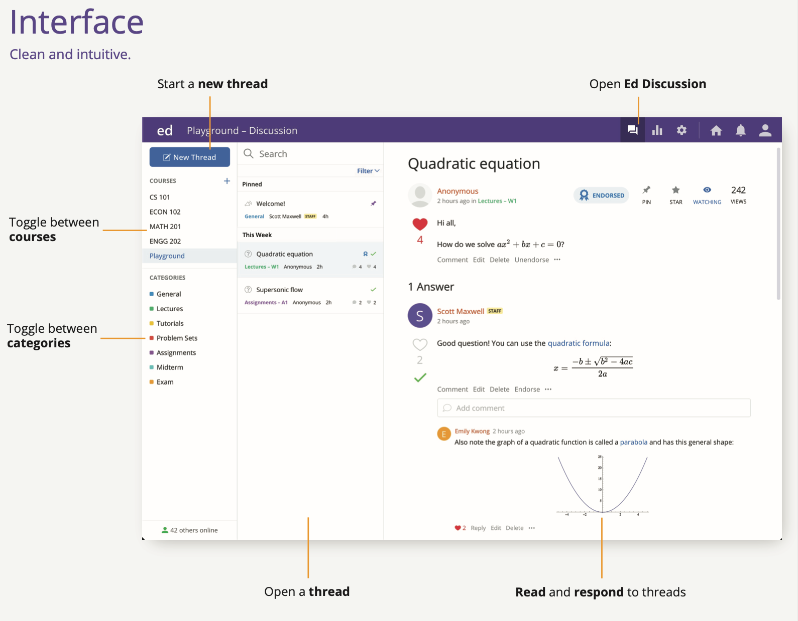
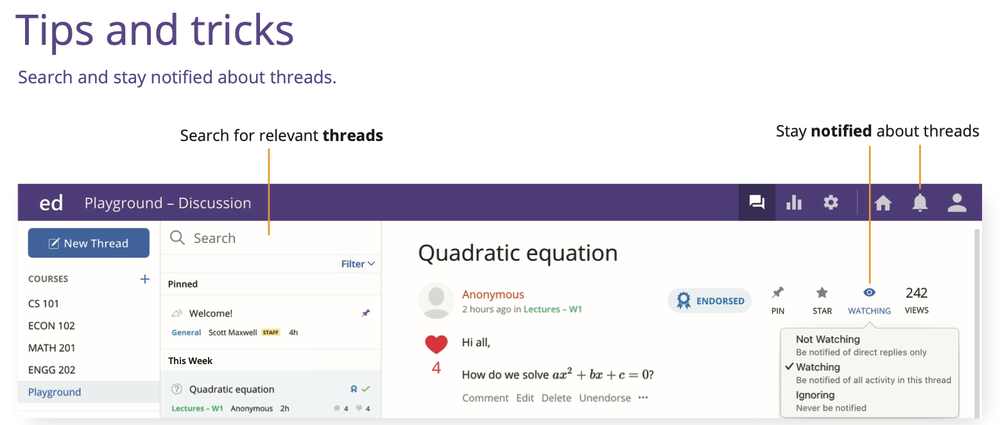
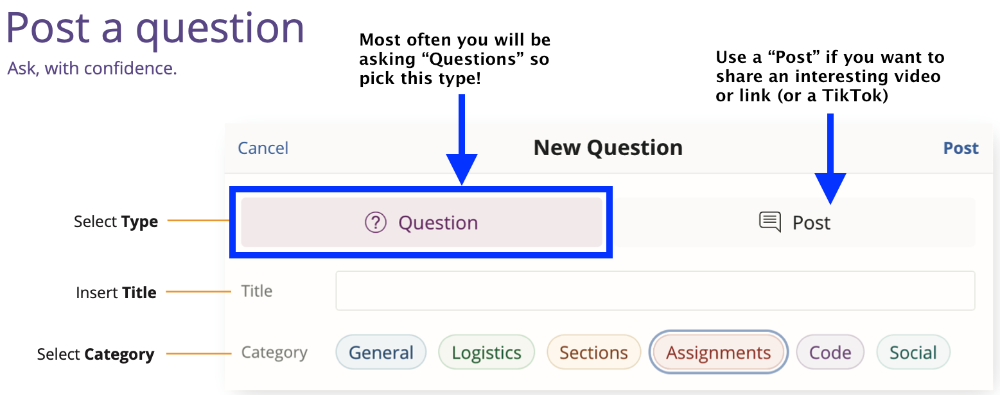
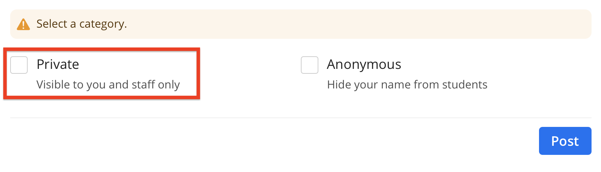
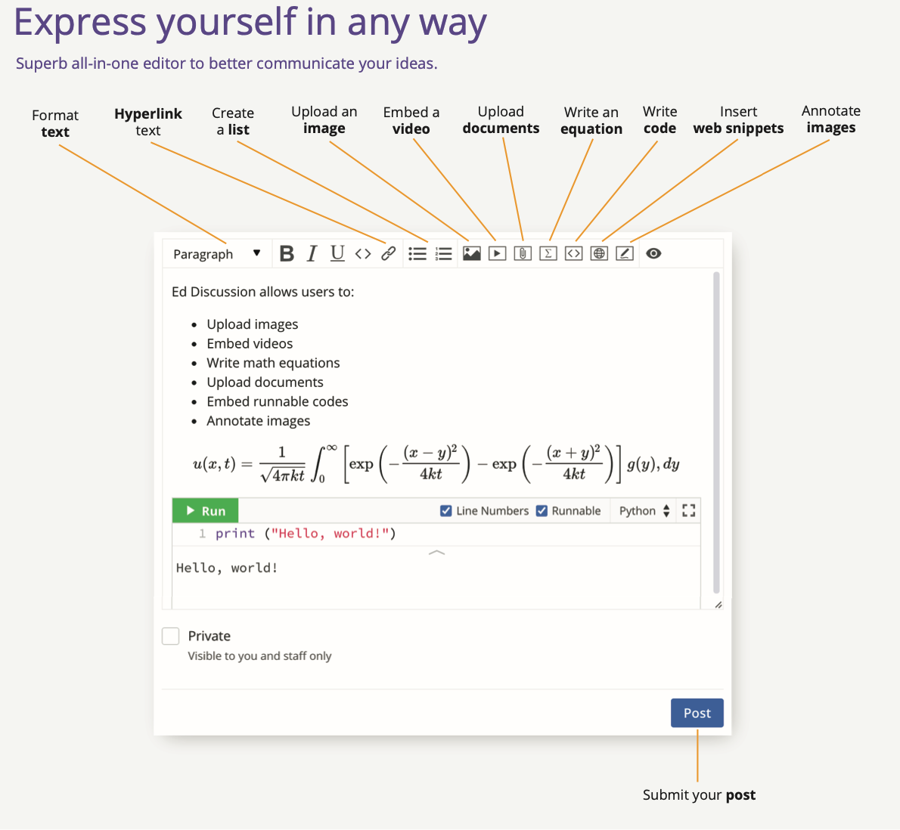
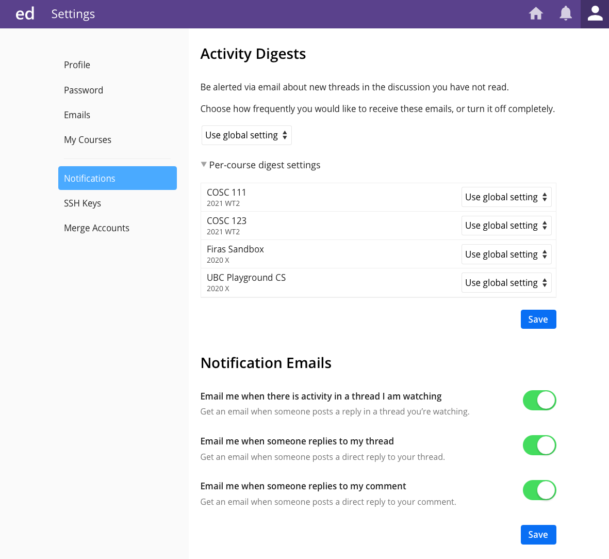
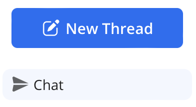
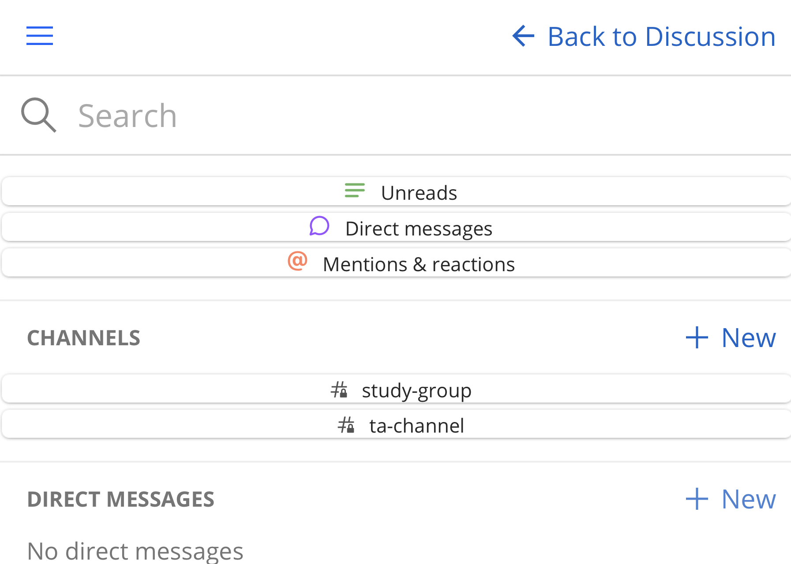

(tools_ed_discussion)=
# Ed Discussion

Hello everyone!

We will be using Ed Discussion for our class Q&A, it's really great! I hope you like it.

This is the best place to ask questions about the course, whether about content, or logistics. You should ask every question here, and the only thing you need to decide is whether your question should be public (helps everyone) or private (applies only to you, for e.g., regrade requests, personal circumstances etc...)

You will get faster answers here from the teaching team as well as other students here on Ed Discussion - all of your TAs are on here as well. Neither TAs nor instructors will be responding to emails or Canvas messages, unless it's a legitimate emergency.

At various points in the course, I will give you some tips and suggestions on how to more effectively ask for, and give help.

Here are some tips:

- Do a quick scan to search before you post, it's possible your question was already asked. If it has, add a response to it, rather than creating a new question

- Click the heart emoji ❤️ for questions and answers you find/found useful

- Try to answer questions you feel comfortable answering and just try your best! If it's not quite correct, TAs and instructors will be offering helpful edits and corrections. This will be a learning experience as well.

- For each questions that were answered by students (high recommended!), the first answer that we think is fully correct, we will "Endorse" it - this means that the answer was approved by an instructor

- Share interesting course related content with staff and peers - ask lots of questions and let's build a community together!

Here is a quick overview of the main features of Ed Discussion:

## 1. Interface

## 2. Find and stay up-to-date on your questions

## 3. How to Post a Question

Most of the time, you should select "Question" instead of a "Post".
A post can be used for things that you don't necessarily want a response to, sharing of resources, videos, etc...

## 4. How to ask private questions ONLY to the instructor

To make a post/question Private, simply click on the box that says "Private". You can also post anonymously to other students (but the TAs and instructor will still know who posted).

In general, I suggest asking open and public questions so others can benefit from answers and we can crowd-source knowledge. For questions that you think are private and relevant only to you, you can ask them privately so only the instructors see the question.

## 5. Use the editor and all its' features

## 6. Set your notification settings!

I suggest you enable notification emails so that you get an email when someone replies to your thread or a comment that you made. 

## 7. Refer to other posts

Each post has a number associated with it that starts from 1 and counts upwards. You can refer to other posts by using the following syntax: #2.

Ed Discussion is smart enough to turn that into a link, so that if someone clicks on it, they will get taken to Post #2 (which is this one).

## 8. (NEW!) Can I contact other students in the class (DM) ?

Yes - Ed Discussion has a new feature called "Ed Chat" (that's in Early Beta) which allows you to chat with other students in the class, and with the teaching team (when they initiate a conversation).
I have turned this feature on, but I urge you to be respectful of how you approach others.
If you find that this feature is causing you grief, or if you are receiving messages that are inappropriate, please let me know anonymously, and I will turn off the ability to contact your peers.
It is my hope that this new functionality allows you to contact your study group partners, make friends, and build community.
The teaching team may reach out to you via Ed Chat.

Ed Chat can be accessed from the left sidebar on your course's main discussion page:

The interface is a bit rough, but the functionality all seems to be there.
You can create a "public channel" that other students can join, or create a "private channel" for situations where you want to control the members in the group.
There is also the ability to send "direct messages (DMs)" directly to one or more students.

Let me know if you find this new functionality useful!

## Quick Start Guide

Here is a [PDF of the Quick Start Guide to Ed Discussion](https:/edstem.org/quickstart/ed-discussion.pdf).